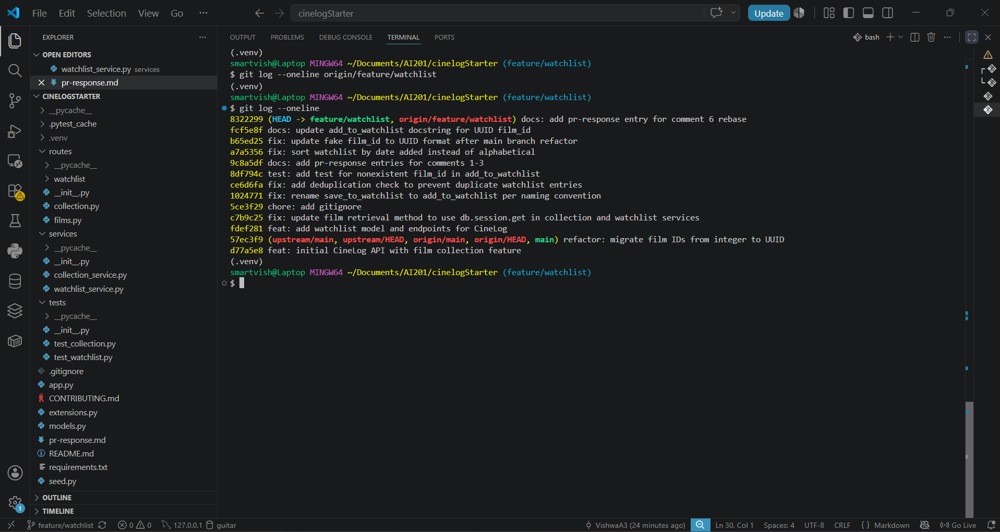

# PR Response Doc: CineLog Watchlist Feature 
## Comment 1: Rename
**What I did:** Renamed `save_to_watchlist()` to `add_to_watchlist()` in `services/watchlist_service.py` to match the project's `verb_to_noun` naming convention used by `add_to_collection()`. Updated the import and call site in `routes/watchlist/watchlist.py` (the `add_film` route handler).
**How I verified:** Searched the codebase for all references to `save_to_watchlist` to confirm only one call site existed (`routes/watchlist/watchlist.py`). Ran the full test suite (`pytest tests/ -v`) after the change to confirm nothing broke.

## Comment 2: Deduplication
**What I did:** Added an `AlreadyInWatchlistError` exception class and a duplicate check inside `add_to_watchlist()`, following the same pattern as `add_to_collection()` in `collection_service.py`, after confirming the film exists, query for an existing `WatchlistEntry` with the same `user_id` and `film_id`, and raise `AlreadyInWatchlistError` if one is found, before creating a new entry.
**How I verified:** Ran the full test suite to confirm existing tests still pass.

## Comment 3: Missing test
**What I did:** Created `tests/test_watchlist.py` with `test_add_to_watchlist_nonexistent_film_raises`, mirroring `test_add_to_collection_nonexistent_film_raises` from `test_collection.py`. Used the same `app`, `sample_user`, and `sample_film` fixture pattern, and asserted that calling `add_to_watchlist()` with a nonexistent `film_id` raises `FilmNotFoundError`.
**How I verified:** Ran `pytest tests/test_watchlist.py -v` (passed), then the full suite `pytest tests/ -v` (all 5 tests passed).

## Comment 4: Default visibility
**My position:** Keep `public=True` as the default.
**Reasoning:** CineLog is a social film-tracking app, the value of a watchlist is determined from other users being able to see what you're planning to watch, which helps discovery and engagement, like how Letterboxd's lists work. Defaulting it to general public means the feature shows its social value, and users do not have to manually toggle a setting first.
**Tradeoff acknowledged:** The risk is that some users may not expect their watchlist to be visible by default and could feel their privacy was violated by surprise, especially since film taste can feel personal. This is done by the `public` field already existing on the `WatchlistEntry` model, making a future opt-out toggle hard or questionable to add, and by ensuring the API response clearly shows the current visibility state to the user.

## Comment 5: Sort order
**My position:** Switch to sorting by date added (descending), matching @dev-lead's suggestion.
**Reasoning:** A watchlist represents "what's next," so recency of intent is more useful to a user than alphabetical order. This also brings `get_watchlist()` in line with `get_collection()`, which already sorts by `date_added` descending, keeping the two features behaviorally consistent for anyone using both.
**Engagement with reviewer's point:** I agree directly with @dev-lead's reasoning, most users think "what did I just add" rather than "where does this fall alphabetically," so optimizing for recency serves the actual use case better than alphabetical did.

## Comment 6: Rebase
**What conflicted:** A conflict occurred in `models.py` on the `WatchlistEntry.film_id` column. My branch still defined it as `db.Integer` (with `index=True`), while `upstream/main` had migrated it to `db.String(36)` as part of the UUID refactor.
**How I resolved it:** Kept the UUID type (`db.String(36)`) from main to match the rest of the schema, while preserving the `index=True` attribute from my original definition. After resolving `models.py`, I audited `services/watchlist_service.py` and `tests/test_watchlist.py` for any remaining integer-ID assumptions, updated a stale docstring that still described `film_id` as an integer, and updated my test's fake film ID from an integer (`99999`) to a UUID-formatted string to match the new schema.

## PR Description
**What this feature does:**
Adds a watchlist feature to CineLog, allowing users to save films they want to watch later (as distinct from their collection of already-watched films). Includes a `WatchlistEntry` model, service functions (`add_to_watchlist`, `get_watchlist`), and REST endpoints (`GET /watchlist/<user_id>`, `POST /watchlist/<user_id>/add`).

**Design decisions:**
- **Default visibility:** Watchlists default to `public=True`, since visibility to other users is core to the social/discovery value of the feature (see Comment 4 for full reasoning).
- **Sort order:** Watchlists are sorted by `date_added` descending (most recently added first), matching the existing `get_collection()` behavior (see Comment 5 for full reasoning).

**How to manually test:**
1. Start the app: `python app.py`
2. Create a user and a film via their respective endpoints (or use existing seed data).
3. Add a film to a user's watchlist:
curl -X POST http://127.0.0.1:5000/watchlist/<user_id>/add -H "Content-Type: application/json" -d "{"film_id": "<film_id>"}"

4. View the watchlist:
curl http://127.0.0.1:5000/watchlist/<user_id>

5. Confirm the returned film includes `date_added` and `public: true`.
6. Try adding the same film again — confirm you get an `AlreadyInWatchlistError` (500 response) instead of a duplicate entry.
7. Run the automated test suite: `pytest tests/ -v` — all 5 tests should pass.

## Commit History Screenshot

## AI Usage
I used AI throughout this project to understand the git rebase and conflict-resolution workflow when I got stuck (e.g., resolving the `models.py` conflict during Comment 6, understanding why `git rebase -i` opens two separate editor windows). I also used it to verify my commit history followed conventional commit format before finalizing. The reasoning behind my Comment 4 and 5 responses (default visibility and sort order) reflects my own conclusions about CineLog's use case as a social film-tracking app.